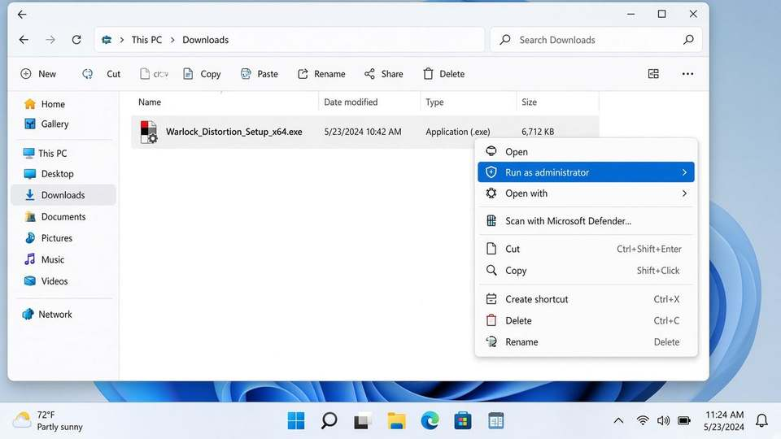
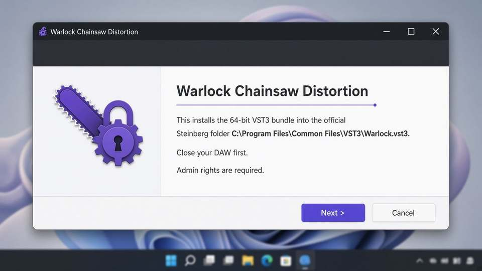
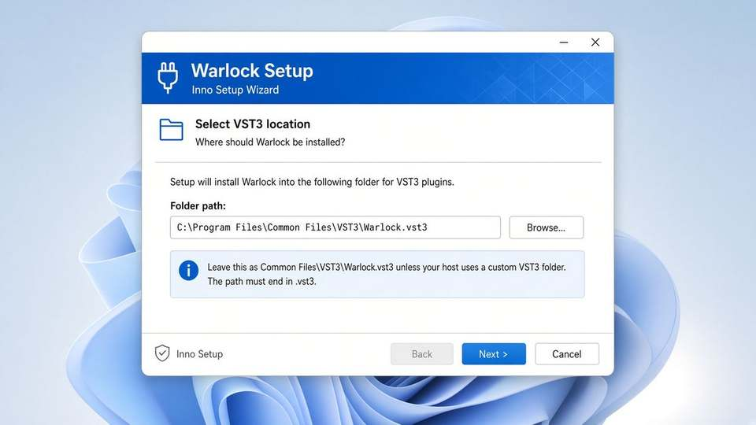
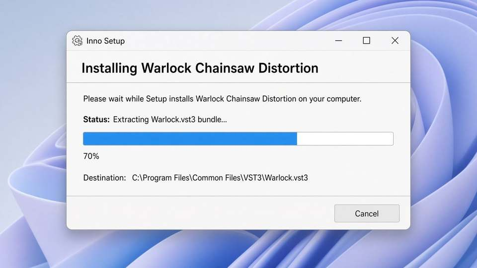
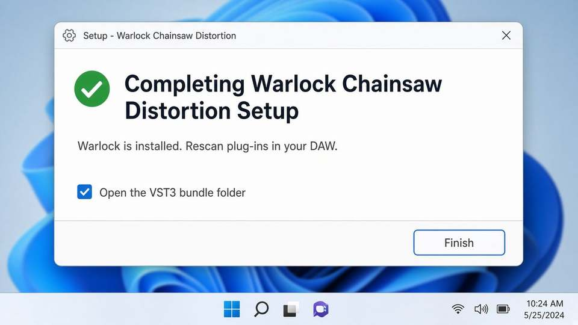
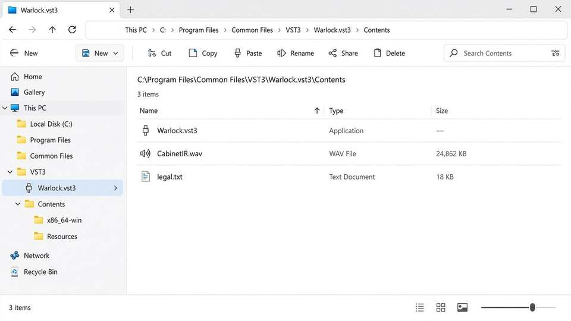
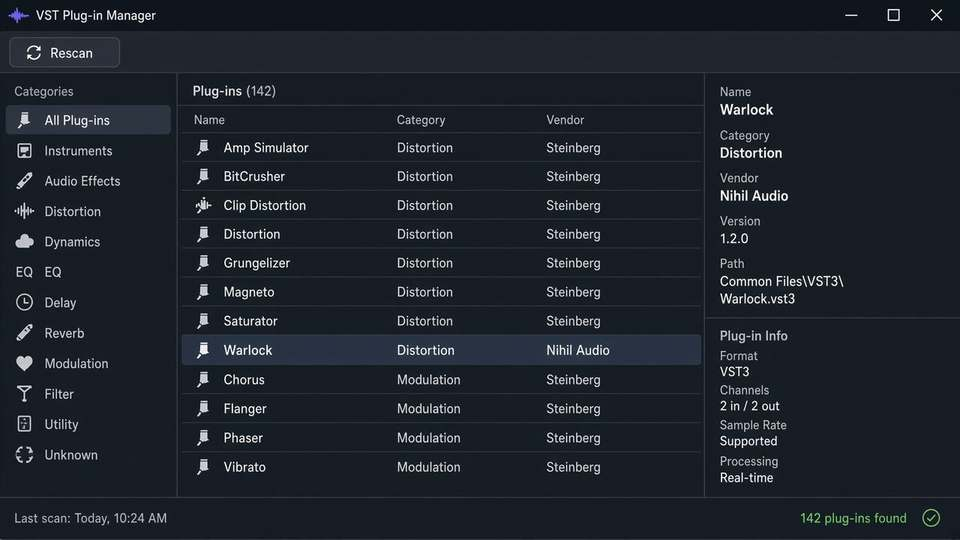

# Warlock VST3 — Installation Guide (Windows x64)

Warlock Chainsaw Distortion **1.1.0** is a **64-bit VST3 bundle**. Not VST2, not AU, not AAX.

Official path (Steinberg):

```
C:\Program Files\Common Files\VST3\Warlock.vst3
```

That folder *is* the plug-in. Hosts scan `Common Files\VST3`. They do not scan `Program Files\Nihil Audio`.

---

## Step-by-step (installer)

Close Cubase, Reaper, Live, FL, Studio One, Bitwig, WaveLab first.

### 1. Run as administrator

Right-click `Warlock_Distortion_Setup_x64.exe` → **Run as administrator**. Common Files is protected; a normal user install will fail or land in the wrong tree.



### 2. Welcome

Confirm you are installing the 64-bit VST3 into `C:\Program Files\Common Files\VST3\Warlock.vst3`. Click **Next**.



### 3. Select VST3 location

Leave this path unless your host uses a custom VST3 folder. It **must** end in `.vst3` — that folder is the Steinberg bundle, not a vendor directory.



```
C:\Program Files\Common Files\VST3\Warlock.vst3
```

### 4. Install

If Windows asks to close a locked DAW, allow it. The DLL cannot be replaced while a host has it open.



### 5. Finish

Optionally tick **Open the VST3 bundle folder**, then **Finish**.



### 6. Check the bundle

You should see:

```
Warlock.vst3\
└── Contents\
    ├── x86_64-win\Warlock.vst3     ← 64-bit PE DLL
    └── Resources\CabinetIR.wav
```

Do **not** copy the inner DLL up to the VST3 root.



### 7. Rescan in the DAW

Insert **Warlock** under Fx / Distortion, vendor **Nihil Audio**.



| Host | Rescan |
|---|---|
| Cubase / Nuendo | Studio → VST Plug-in Manager → Rescan |
| Reaper | Preferences → Plug-ins → VST → Clear cache / re-scan. If the bundle is invisible, add `...\VST3\Warlock.vst3\Contents\x86_64-win` |
| Ableton Live | Preferences → Plug-Ins → Use VST3 Plug-In System Folders → Rescan |
| FL Studio | Options → Manage plugins → Find plugins |
| Studio One | Options → Locations → VST Plug-ins → Rescan |
| Bitwig | Settings → Locations → VST3 → Rescan |

---

## Silent install

```
Warlock_Distortion_Setup_x64.exe /VERYSILENT /NORESTART /ALLUSERS
```

Windows 10/11 x64 (or Windows-on-ARM x64 emulation). Admin required.

Uninstall: **Settings → Apps → Warlock Chainsaw Distortion**.

## Manual copy (no installer)

Copy the whole folder `build\Warlock_artefacts\Release\VST3\Warlock.vst3` to `C:\Program Files\Common Files\VST3\Warlock.vst3`. Then rescan.

## What not to do

- Do not install into `C:\Program Files\Nihil Audio`
- Do not use `C:\Program Files (x86)\Common Files\VST3` (32-bit)
- Do not flatten the bundle into a single file at the VST3 root (Cubase will miss it)
- Do not keep a DAW open while overwriting the DLL

## Build the installer from source

Visual Studio 2022 x64, CMake ≥ 3.22, git, [Inno Setup 6.3 or 7](https://jrsoftware.org/isdl.php).

```
cmake -B build -G "Visual Studio 17 2022" -A x64
cmake --build build --config Release
```

Open `installer.iss` → Compile. Output: `BuildInstaller\Warlock_Distortion_Setup_x64.exe`.

`{app}` **is** `Warlock.vst3`. Files unpack *into* that folder.

The browser Warlock is a DSP preview. It is not the VST3 you install into a DAW.
